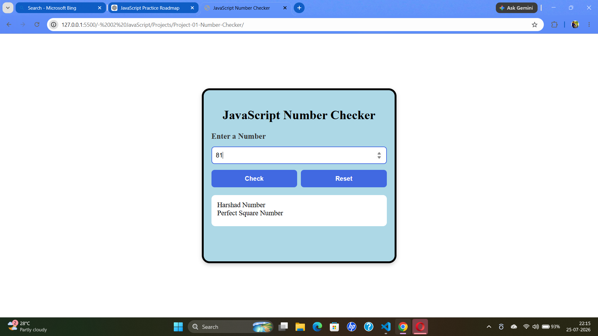

# JavaScript Number Checker

A responsive JavaScript project that checks whether a given number satisfies different mathematical properties.

## Features

- Strong Number
- Perfect Number
- Spy Number
- Harshad Number
- Neon Number
- Perfect Square
- Automorphic Number
- Reset Button
- Enter Key Support
- Responsive Design
- Input Validation

## Technologies Used

- HTML5
- CSS3
- JavaScript (ES6)

## Folder Structure
Project-01-Number-Checker
│
├── index.html
├── style.css
├── script.js
├── README.md
└── assets
└── output.png

## How to Run

1. Clone or download this repository.
2. Open the project folder.
3. Open `index.html` in your browser.
4. Enter a number and click **Check**.

## Screenshot

## Future Improvements

- Armstrong Number
- Prime Number
- Palindrome Number
- Fibonacci Number
- Duck Number
- Sunny Number
- Happy Number

## Author

**Sourav Yadav**